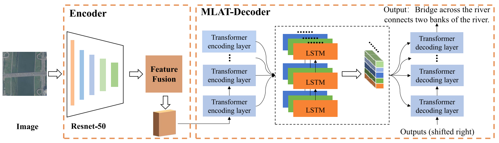

# Remote Sensing Image Captioning Based on Multi-layer Aggregated Transformer
Here, we provide the pytorch implementation of the paper: "Remote Sensing Image Captioning Based on Multi-Layer Aggregated Transformer". 

For more information, please see our published paper in [[IEEE](https://ieeexplore.ieee.org/document/9709791) | [Lab Server](http://levir.buaa.edu.cn/publications/Captioning-Based-on-Multilayer-Aggregated-Transformer.pdf)]  ***(Accepted by GRSL 2022)***



## Train
Firstly, download the RSICD dataset. Then preprocess the data as follows:
```python
python create_input_files.py --karpathy_json_path ./RSICD_captions/dataset_rsicd.json --image_folder ./RSICD_captions/images/
```
After that, you can find some resulted metadata files in `./data/`
Secondly, train model: 
```python
python train5.py
```
Note: During training, beam search is not used when computing scores on the validation set. To get the evaluation score with the beam search strategy, run the following command to get the score on the test set:
## Test
```python
python eval.py
```

## Citation: 
```
@ARTICLE{9709791,
  author={Liu, Chenyang and Zhao, Rui and Shi, Zhenwei},
  journal={IEEE Geoscience and Remote Sensing Letters}, 
  title={Remote-Sensing Image Captioning Based on Multilayer Aggregated Transformer}, 
  year={2022},
  volume={19},
  number={},
  pages={1-5},
  doi={10.1109/LGRS.2022.3150957}}
```
## Reference:
Thanks to the following repository:
[a-PyTorch-Tutorial-to-Image-Captioning](https://github.com/sgrvinod/a-PyTorch-Tutorial-to-Image-Captioning.git)
